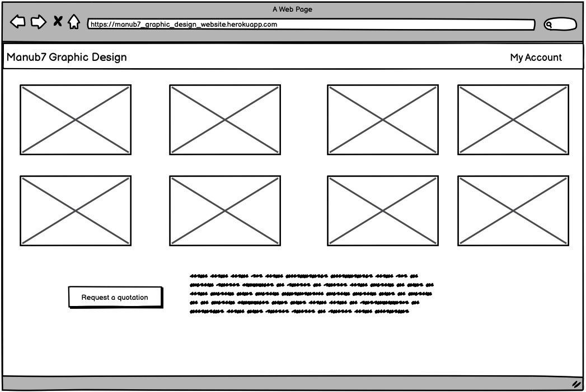

# The Graphic Design Freelance website

  This is my milestone project I am doing with  Code Institute for the Full Stack Frameworks With Django module. The is a pseudo-website that allows me sell your graphic design services with users being able to purchase graphical design to address their needs 

## UX
 
The website structure is minimalist and functional where the user is greeted with the landing page where he can view a nice carousel displaying previous designs has and has an the option to register an accound to make requests.

The wireframe was designed using Balsamic and the example can be viewed here below.
 

## Features

The website has multiple features for the user to manipulate the data base
 
### Existing Features

### Features Left to Implement

## Technologies Used

- [JQuery](https://jquery.com)- The project uses **JQuery** to simplify DOM manipulation.
- [MongoDB](https://www.mongodb.com/cloud/atlas)
- [Django](https://www.djangoproject.com/)
- [HTML](https://www.w3schools.com/html/html_intro.asp)
- [CSS](https://www.w3.org/Style/CSS/Overview.en.html)
- [Bootstrap](https://getbootstrap.com/)

## Testing

The website was manualy tested with Chrome Developer Tool in a Test Driven Development approach on difrerent screen size as well on other browsers such as Edge and Firefox.

Testing procedure 
1. 
2. 

3. 
4. 
5. 
3. 

## Deployment

At the begining of the project I first created a heroku account  and used the GitHub deplyement method to link it with the current workspace. Once linked I created the requirements.txt file and the Procfile
followed by the variables configuration on the Heroku website where i have configured all sesitive data variables. 

Each time I commit and push  to the server the HEROKU gets updated with the latest version. The only diffrence between the development and the production version 
represents the debug tool which is turned off.  You can view the production version [here](https://cookbook-milestoneproject.herokuapp.com/)

## Credits

- The carousel display that has been well modified to suit my project can be found [here](https://stackoverflow.com/questions/20007610/bootstrap-carousel-multiple-frames-at-once)
